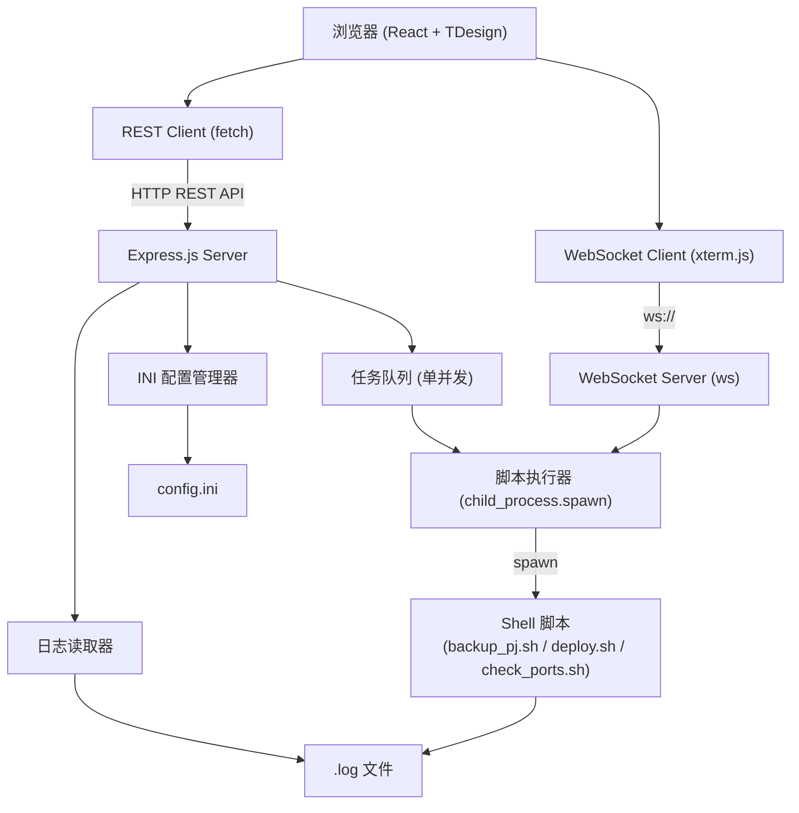

## 用户需求

将现有的 deploy-tool Shell 脚本工具集，改造为一个可在浏览器中访问和操作的 Web 管理站点，保留并增强所有原有脚本功能。

## 产品概述

一个运维部署管理 Web 平台，后端调用原有 Shell 脚本逻辑，前端提供可视化操作界面。用户可通过浏览器完成项目备份、部署、端口检测等操作，并实时查看任务执行进度和日志输出。

## 核心功能

### 项目管理

- 从 `config.ini` 动态读取所有已配置的项目列表，以卡片形式展示
- 每个项目卡片显示：项目名、服务器地址、绑定端口及其实时状态（在线/离线）
- 支持查看/编辑项目配置（server、local_dir、remote_dir、backup_dir、restart_cmd、bind-port、exclude）

### 部署功能

- 选择单个项目，点击"部署"按钮触发部署流程
- 支持"干跑模式"（DRY_RUN）开关
- 部署过程实时日志流（打包 → 上传 → 解压 → 重启），WebSocket 推送到前端终端区域
- 显示每一步的执行状态（成功/失败）

### 备份功能

- 支持单项目备份或一键全量备份
- 显示备份文件路径和文件大小
- 任务执行实时日志流输出

### 端口检测

- 支持单项目或全部项目端口检测
- 结果以列表方式展示每个端口的状态（绿色在线 / 红色离线）
- 支持手动刷新或定时自动检测（可选）

### 任务日志

- 历史任务记录列表（任务类型、项目名、时间、成功/失败）
- 查看历史任务的完整日志内容（对应 .log 文件）

### SSH 配置管理

- 查看当前 `[ssh]` 节的 user / key 配置
- 支持修改 SSH 用户名和私钥路径

## 技术栈

### 后端

- **Runtime**: Node.js (LTS)
- **框架**: Express.js + TypeScript
- **实时通信**: WebSocket（`ws` 库），用于任务执行日志实时推送
- **Shell 执行**: Node.js `child_process.spawn`，调用现有 `.sh` 脚本
- **INI 解析**: `ini` npm 包解析 `config.ini`，同时支持写回

### 前端

- **框架**: React 18 + TypeScript
- **构建工具**: Vite
- **UI 组件**: TDesign React（`tdesign-react`）
- **样式**: Tailwind CSS
- **状态管理**: Zustand（轻量）
- **实时日志**: WebSocket 客户端接收，类终端 xterm.js 渲染日志流

### 项目组织

- Monorepo 扁平结构：`server/`（后端）+ `web/`（前端），共享类型定义

---

## 实现方案

### 核心架构思路

后端作为 Shell 脚本的代理层（Proxy Layer）：不重写脚本逻辑，而是通过 `child_process.spawn` 直接调用现有 `.sh` 脚本，将 stdout/stderr 实时通过 WebSocket 推送到前端。前端使用 xterm.js 渲染类终端日志，保持与原脚本一致的视觉风格（ANSI 颜色转义码支持）。

### 关键技术决策

1. **直接调用现有脚本而非重写逻辑**：最大程度复用已有代码，降低回归风险；脚本本身已有完善的错误处理和日志记录。
2. **WebSocket 实时日志流**：替代轮询方案，部署/备份任务可能耗时较长，实时流是最优体验。
3. **xterm.js 终端渲染**：脚本输出含 ANSI 颜色转义码（tput 颜色），xterm.js 原生支持渲染，无需转换。
4. **INI 文件直接读写**：后端提供配置管理 API，直接操作 `config.ini`，不引入数据库，保持轻量。
5. **任务队列（单并发）**：同一时刻只允许一个部署/备份任务执行，防止 SSH 冲突，用内存队列实现。

### 性能与可靠性

- Shell 脚本调用为 I/O 密集型，Node.js 异步模型天然适配，无需额外优化
- WebSocket 连接断开时自动降级为日志文件查看
- 任务状态存储在内存 + 写入 `.log` 文件，重启后可从 log 文件恢复历史记录

---

## 架构设计



---

## 目录结构

```
f:\软件项目\deploy-tool\
├── script/                         # [KEEP] 现有脚本，不修改
│   ├── backup_pj.sh
│   ├── deploy.sh
│   ├── check_ports.sh
│   ├── deploy-tool-ui.sh
│   └── config.ini
│
├── server/                         # [NEW] 后端服务
│   ├── src/
│   │   ├── index.ts                # [NEW] 服务入口，Express + WebSocket Server 启动
│   │   ├── types.ts                # [NEW] 共享类型：Project、Task、TaskStatus、LogEntry
│   │   ├── config/
│   │   │   └── iniManager.ts       # [NEW] INI 文件读写：getProjects/getSSHConfig/updateProject
│   │   ├── tasks/
│   │   │   ├── taskQueue.ts        # [NEW] 任务队列：单并发控制，任务状态管理
│   │   │   └── scriptRunner.ts     # [NEW] 脚本执行器：spawn 调用 .sh，stdout/stderr 流转发
│   │   ├── routes/
│   │   │   ├── projects.ts         # [NEW] GET /api/projects，GET/PUT /api/projects/:name
│   │   │   ├── tasks.ts            # [NEW] POST /api/tasks/deploy|backup|check-ports，GET /api/tasks
│   │   │   ├── logs.ts             # [NEW] GET /api/logs/:taskId，GET /api/logs/files
│   │   │   └── ssh.ts              # [NEW] GET/PUT /api/ssh-config
│   │   └── ws/
│   │       └── wsHandler.ts        # [NEW] WebSocket 处理：任务订阅、日志广播
│   ├── package.json                # [NEW] 依赖：express, ws, ini, typescript
│   └── tsconfig.json               # [NEW]
│
├── web/                            # [NEW] 前端应用
│   ├── src/
│   │   ├── main.tsx                # [NEW] React 应用入口
│   │   ├── App.tsx                 # [NEW] 路由根组件（React Router）
│   │   ├── types.ts                # [NEW] 与后端共享的 TS 类型定义
│   │   ├── api/
│   │   │   ├── http.ts             # [NEW] fetch 封装，统一错误处理
│   │   │   └── ws.ts               # [NEW] WebSocket 连接管理、重连逻辑
│   │   ├── store/
│   │   │   └── appStore.ts         # [NEW] Zustand store：projects/tasks/portStatus 全局状态
│   │   ├── pages/
│   │   │   ├── Dashboard.tsx       # [NEW] 首页仪表盘：项目卡片列表 + 端口状态总览
│   │   │   ├── DeployPage.tsx      # [NEW] 部署页：项目选择、DRY_RUN 开关、实时日志终端
│   │   │   ├── BackupPage.tsx      # [NEW] 备份页：项目选择（含全部）、实时日志终端
│   │   │   ├── PortCheckPage.tsx   # [NEW] 端口检测页：检测结果表格、刷新按钮
│   │   │   ├── LogsPage.tsx        # [NEW] 日志历史页：任务列表 + 日志内容查看
│   │   │   └── SettingsPage.tsx    # [NEW] 设置页：SSH 配置 + 项目配置编辑
│   │   ├── components/
│   │   │   ├── TerminalOutput.tsx  # [NEW] xterm.js 封装组件，渲染 ANSI 日志流
│   │   │   ├── ProjectCard.tsx     # [NEW] 项目卡片，展示名称/服务器/端口状态
│   │   │   ├── TaskStatusBadge.tsx # [NEW] 任务状态徽标（运行中/成功/失败）
│   │   │   └── Layout.tsx          # [NEW] 全局布局：侧边导航 + 顶栏
│   │   └── hooks/
│   │       ├── useTaskWs.ts        # [NEW] WebSocket 任务日志订阅 Hook
│   │       └── useProjects.ts      # [NEW] 项目列表数据 Hook（含轮询端口状态）
│   ├── index.html                  # [NEW]
│   ├── package.json                # [NEW] 依赖：react, tdesign-react, xterm, zustand, vite
│   ├── vite.config.ts              # [NEW] Vite 配置，代理 /api 到后端
│   └── tailwind.config.js          # [NEW]
│
└── package.json                    # [NEW] 根 package.json，scripts: dev/build/start
```

---

## 关键数据结构

```typescript
// types.ts（前后端共享）

interface Project {
  name: string;
  server: string[];          // 支持多 IP
  remoteDir: string;
  backupDir: string;
  localDir: string;
  exclude: string;
  restartCmd: string;
  bindPorts: number[];
}

interface SSHConfig {
  user: string;
  key: string;
}

type TaskType = 'deploy' | 'backup' | 'check-ports';
type TaskStatus = 'pending' | 'running' | 'success' | 'failed';

interface Task {
  id: string;                // uuid
  type: TaskType;
  project: string;           // 项目名，'all' 表示全量
  status: TaskStatus;
  dryRun?: boolean;          // 仅 deploy 使用
  startTime: string;
  endTime?: string;
}

// WebSocket 消息格式
interface WsMessage {
  type: 'log' | 'status' | 'complete';
  taskId: string;
  data: string;              // log: 原始 ANSI 文本；status: TaskStatus
}
```

## 设计风格

采用深色运维风格（Dark Ops Theme）。整体使用深色背景，搭配蓝色/青色主色调，突出专业运维工具的氛围。卡片使用微微发光的边框效果，终端日志区域采用纯黑背景模拟真实终端，状态指示使用绿色（正常）/红色（异常）高饱和度色块。布局简洁清晰，信息密度适中，侧边导航固定，主内容区宽松滚动。

---

## 页面规划（5 个核心页面）

### 1. 仪表盘（Dashboard）

- **顶栏**：Logo + 工具名称"Deploy Tool"，右侧显示当前时间和系统状态指示灯
- **项目卡片区**：每个项目一张卡片，显示项目名、服务器 IP、端口状态彩色标签（绿/红），右上角有快捷操作按钮（部署/备份）
- **最近任务区**：表格展示最近 10 条任务记录（类型、项目、时间、状态），点击可跳转日志
- **端口全览区**：以紧凑的网格形式展示所有项目的端口在线状态，支持一键全量刷新

### 2. 部署页（Deploy）

- **顶栏**：面包屑导航
- **操作区**：项目下拉选择框 + DRY RUN 开关 + "执行部署"按钮
- **进度步骤条**：打包 → 上传 → 解压 → 重启 四步，当前步骤高亮
- **终端日志区**：黑色背景 xterm.js 终端，实时滚动输出 ANSI 着色日志，高度占据页面下半部分

### 3. 备份页（Backup）

- **顶栏**：面包屑导航
- **操作区**：项目选择（含"全部项目"选项）+ "执行备份"按钮
- **终端日志区**：同部署页，实时日志输出
- **备份结果卡片**：任务完成后展示备份文件路径和大小

### 4. 端口检测页（Port Check）

- **顶栏**：面包屑 + 右侧"全量检测"按钮 + 自动刷新间隔选择
- **结果表格**：列为项目名 / 服务器 / 端口 / 状态（彩色徽标）/ 检测时间
- **单项检测**：每行右侧有独立"检测"按钮，点击实时更新该行状态

### 5. 设置页（Settings）

- **SSH 配置卡片**：显示并可编辑 user / key 路径，保存按钮
- **项目配置列表**：折叠面板，每个项目展开后可编辑全部 INI 字段（Inline 表单），保存后写回 config.ini
- **日志文件区**：展示 deploy.log / backup_pj.log / check_ports.log 的文件大小和最后修改时间，支持下载和清空

## Agent Extensions

### Skill

- **simplify**
- Purpose：在完成各模块代码编写后，对关键组件（TerminalOutput、taskQueue、scriptRunner）进行代码简化和一致性检查
- Expected outcome：代码结构清晰、无冗余逻辑，保持各模块风格统一